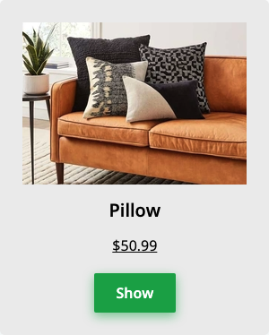

# CSS: Product card
Complete a partially completed application. Complete the application shown below in order to pass all the unit tests.

## Environment 

- Node Version: ^18
- Default Port: 8000

## Application Demo:


## Application description

Complete a product card layout with the following UI:

Your card contains following elements:
* Image
* Title
* Price
* Button

Apply following rules on the card so that every component is located exactly how it is shown on the template:
* Card should have grey background color (#ededed)
* Card should have border radius of 5px
* Title should have 20px size
* Title should be bold
* Title should be centered
* Price should be underlined
* Price should be centered
* Button should be centered
* All elements should have a distance between each other as described on the template image

All the markup for the question has been added. As a candidate, you have to complete the CSS file to implement the above-stated features.

## Project Specifications

**Read Only Files**
- `test/*`
- `src/index.js`
- `src/index.html`
- `src/css/readonly.css`
- `app.js`

**Commands**
- run: 
```bash
npm start
```
- install: 
```bash
npm install
```
- test: 
```bash
npm test
```
